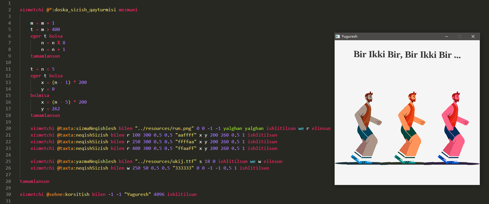
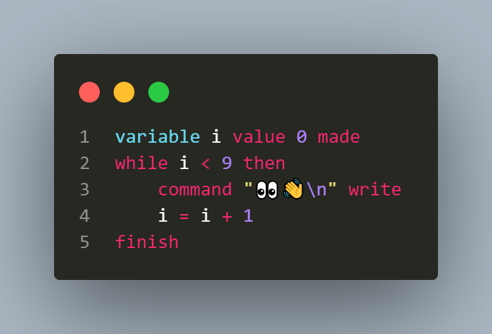
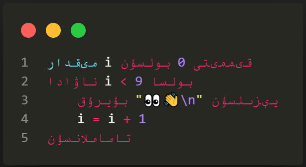
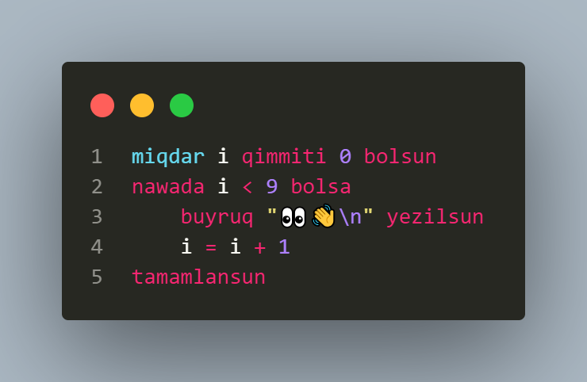
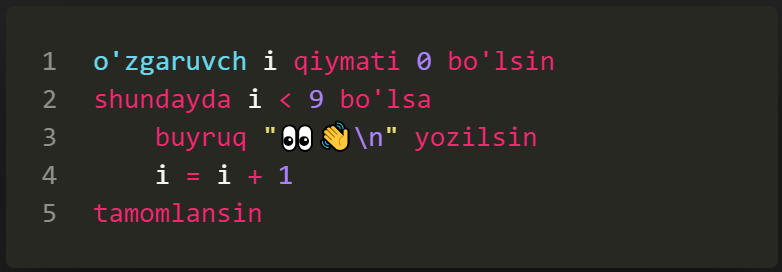
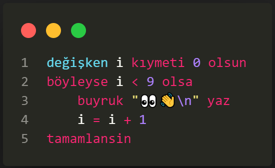
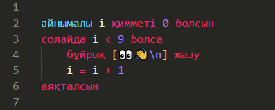

# UyghurScript

## 0. description

> a toy script interpreter written in c, u can write & run your script written in uyghur language grammar with it ...

> 

* read [documents](./documents/) for more informations


* run `./release/uyghur.exe` to get help content

* cick `./release/yuguresh.exe` to run raylib example



## 1. multiple langauge


* a. [english](examples/language/en)




* b. [ئۇيغۇرچە](examples/language/uy)




* c. [uyghurche](examples/language/ug)




* d. [o'zbekcha](examples/language/uz)




* e. [Türkçe](examples/language/tr)




* f. [қазақша](examples/language/kz)




## 2. highlight & translating

* vscode [extension](https://marketplace.visualstudio.com/publishers/Atypicalim) for highlighting and autocompleting.

* language [converter](https://Atypicalim.github.io/others/converter.html) for translating different languages.

## 3. supported features

* [variable](examples/features/variable)

```powershell
# a dynamic var
variable m value empty made

# a static var
variable n value num made

# set val
m = "salam dunya!"

# free val
m value empty made

# type error
n = "sinaq..."
```

* [type](examples/features/type)

```powershell
variable m value "yezish" made

# convert to func
m value worker made
command m write

# convert to bool
m value logic made
command m write
```

* [calculation](examples/features/calculation)

```powershell
# arthimetic
x = 1 + 2 # 3
x = 1 + 2 * 3 # 7
x = (3 + 6) / 3 # 3
x = 2 ** 3 # 8
x = 64 ** (1 / 3) # 4
x = 13 // 5 # 2
x = 13 % 5 # 3

# bitwise
x = 3 & 2 # 2
x = 3 | 2 # 3
x = 3 ^ 2 # 1

# boolean
x = right & wrong # wrong
x = right | wrong # right
x = right ^ wrong # right

# logic
x = "2" ? 2 # false
x = 2 < 3 # true
x = "ab" > "ac" # false 

# string
x = "ab" + "cd" # abcd
x = "ab" * 2 # abab

# check equal
x = 10 ? 10 # true
x = 10 ? num # false

# check contain or typeof
x = 10 ! num # true
x = 10 ! empty # false
x = 3 ! 1 # true
x = "abc" ! "b" # true
```

* [command](examples/features/command)

```powershell
# read a val
command a read

# print a val
command a write
```

* [if](examples/features/if)

```powershell
if 0 then
    command "if" write
elif right then
    command "elif" write
else
    command "else" write
finish
```

* [while](examples/features/while)

```powershell
variable i value 0 made
while i < 9 then
    command "while\n" write
    i = i + 1
finish
```

* [spread](examples/features/spread)

```powershell
speaded "abc..." variable k v become
    command k write
    command "\t" write
    command v write
    command "\n" write
finish
```

* [worker](examples/features/worker)

```powershell
# a func with two args
worker f variable x y content
    variable t value 0 made
    t = x + y
    result t returned
finish

# call func and receive rsp
worker f with 10 20 applied and r received

# print the val received
command r write
```

* [closure](examples/features/closure)

```powershell
# a closure maker func
worker make content

    # a var in env
    variable x value 0 made
    variable r value 0 made

    # a func & env
    worker func variable a content
        command x write # 0
        command y write # 200
        r = r + a
        result r returned
    finish

    # ret the closure func
    result func returned
finish

# some vars in mod
variable x value 100 made
variable y value 200 made

# make closure
worker make applied and f received

# print 11
worker f with 11 applied and r received
command r write

# print 22
worker f with 11 applied and r received
command r write
```

* [exception](examples/features/exception)

```powershell
variable x value empty made

# try block
exception e become
    x = 3 / 0
finish

# catch block
if e then
    command "exception:\n" write
    command e write
    command "\n" write
else
    command "successful!\n" write
finish
```

* [container](examples/features/container)

```powershell
#  declare a list
t value list made
#  declare a dict
s value dict made

# generate a list
t = [11, 22, "abc"]
# generate a dict
s = {a: "aa", b: "bb", c: 123}

# put a num key
@t.1 = 456
# put a str key
@s.k = "abc"
# put a var key
@s{v} = val

# alias: this: - bu, module: + bolek, global: * global

# check type
b = t ! list
```

* [objective](examples/features/objective)

```powershell
# an assister with one argument
assister X variable x content
    @-.x = x
finish

# assister func
worker @X.test content
    command "X.test...\n" write
finish

# a creator with one arguments
creator Y variable y content
    creator X with "arg xxx ...\n" applied 
    @-.y = y
finish

# creator func
worker @Y.test content
    worker @X.test applied
    command "Y.test...\n" write
finish

# call creator using an assister and receive object
creator Y with "arg yyy ...\n" applied and r received

# print the object val received
command @r.x write # arg xxx ...
command @r.y write # arg yyy ...

# call creator func which calling assister func inside
worker @r.test applied
# X.test...
# Y.test...

# check obj is created by or assisted by
if r ! X then
    command "yes\n" write
finish
# yes
```

* [import](examples/features/import)

```powershell
# other.xx
variable x value "other..." made

# main.xx
worker ekirish with "../other.xx" applied and m received
command @m.x write

# run the program
`.uyghur.exe ./main.xx`

# get the rsp
other...
```


--------------------------------

## 4. supported libraries

* [internals](./documents/internals)

* [externals](./documents/externals)

## 5. bridge interfaces

> u can get the bridge objet and communicate between c and script, just check `bridge.c` for more information

*  register a box to script (with some keys of different types)
```c++
Bridge_startBox(bridge);
Bridge_bindBoolean(bridge, "bol", false);
Bridge_bindNumber(bridge, "num", 123);
Bridge_bindString(bridge, "str", "abc...");
Bridge_register(bridge, "boxName"); // NULL
```

* call script function from c (giving one argument and receiving result)
```c++
Bridge_startFunc(bridge);
Bridge_pushNumber(bridge, 123);
Bridge_pushBoolean(bridge, true);
Bridge_pushString(bridge, "abc...");
Bridge_call(bridge, "funcName");
char resultType = Bridge_topType(bridge);
void *resultValue = Bridge_receiveValue(bridge);
```

* register c function for script (receiving two argument and giving result)
```c++
void testFunc(Bridge *bridge)
{
    char resultType = Bridge_topType(bridge);
    bool b = Bridge_receiveBoolean(bridge);
    int n = Bridge_receiveNumber(bridge);
    char *s = Bridge_receiveString(bridge);
    Bridge_returnBoolean(bridge, false);
    Value *v = Value_newEmpty(NULL);
    Bridge_returnValue(this, v);
}
Bridge_startBox(bridge);
Bridge_bindNative(bridge, "testFunc", testFunc);
Bridge_register(bridge, NULL);
```

## 6. todo

* libraries
* ...

## 7. others

> i am still working on it ...
