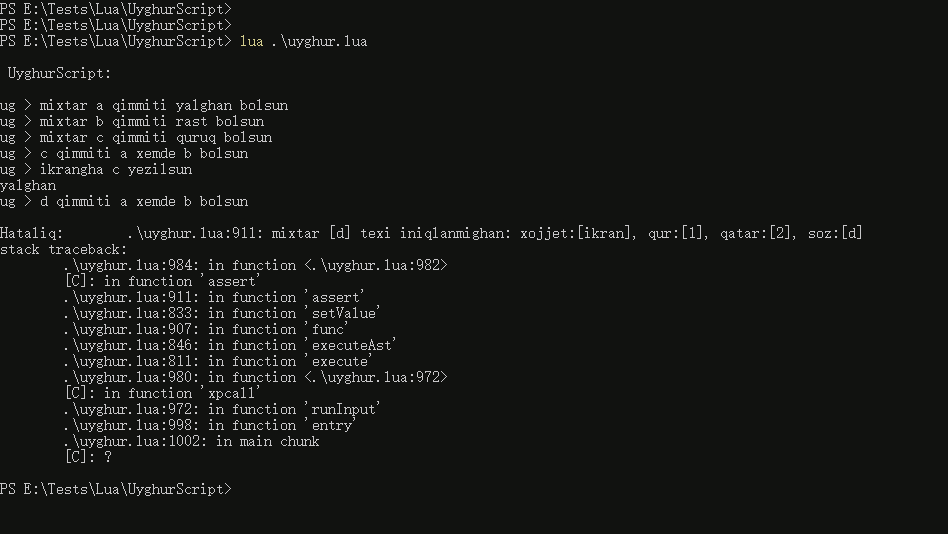

# UyghurScript

## 0. description

> a toy script interpreter writen in lua, u can learn how to write an interpreter by reading this repo ...

## 1. data types and variable declaration

```python

# only chars are supported for variable name, and all the variables are global
mixtar mixtarName qimmiti 0 bolsun

# string
mixtar a qimmiti [Salam Uyghur Script!] bolsun

# number (only interger)
mixtar b qimmiti 1 bolsun

# bool (rast, yalghan)
mixtar c qimimti rast bolsun

# nil
mixtar d qimmiti quruq bolsun

```

## 2. operations

```python

# concat strings
a qimmiti [hi! ] ulanghan a bolsun

# calculate numbers (qushulghan, elinghan, kupeytilgen, bulungen)
b qimmiti a kupeytilghen 10 bolsun

# logic operations (kichik, chong, teng)
c qimmiti a kichik 5 bolsun

# logic operations (hemde, yaki, ekische)
c qimmiti c hemde yalghan bolsun

```

## 3. io

```python

# output
ikrangha [Ana Tilim Zer Tilim!] yezilsun

# input
ikrandin a oqulsun
a qimmiti [mezmun:] ulanghan a bolsun
ikrangha a yezilsun

```

## 4. if

```python

# only if supported (i read the code by line and line , so it is not frendly enough to support elseif and else)
c qimmiti a teng 10 bolsun
# eger (variable) qimmiti (variable|string|number|bool|nil) bolsa
eger c qimmiti rast bolsa
    ikrangha [a ongha teng boldi] yezilsun
tamamlansun

```

## 5. while

```python

# u can write an if statement in it
mixtar d qimmiti 0 bolsun
# nawada (variable) qimmiti (variable|string|number|bool|nil) bolsa
nawada c qimmiti rast bolsa
    d qimmiti d qushulghan 1 bolsun
    ikrangha d yezilsun
    c qimmiti d kichik 5 bolsun
tamamlansun

```

## 6. functions

```python

# variable
mixtar yighinda qimmiti 0 bolsun

# function without args and return
fonkisiye sanYezish bolsa
    ikrangha yighinda yezilsun
tamamlansun

# function with variables and return
fonkisiye sanQushush mixtar x y bolsa
    mixtar waqitliqMixtar qimmiti 0 bolsun
    waqitliqMixtar qimmiti x qushulghan y bolsun
    netije waqitliqMixtar qayturulsun
tamamlansun

# call with variables and receive result
fonkisiye sanQushush bilen 10 20 ishlitilsun we netije yighinda bolsun

# call without variable, and not result 
fonkisiye sanYezish ishlitilsun

```

## 7. usage

* fist of all, u need to download [lua binary](http://luabinaries.sourceforge.net/) to execute this script interpreter
* write your scripts in `example.ug` and run command `lua uyghur.lua example.ug`
* run the command `lua uyghur.lua` and type your code in the REPL

## 8. example



## 8. end

> tokenizer and parserhave been implemented in this repo, and i am still working on executer ...
