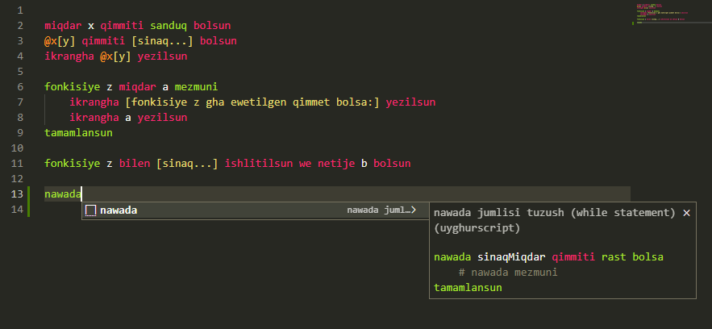
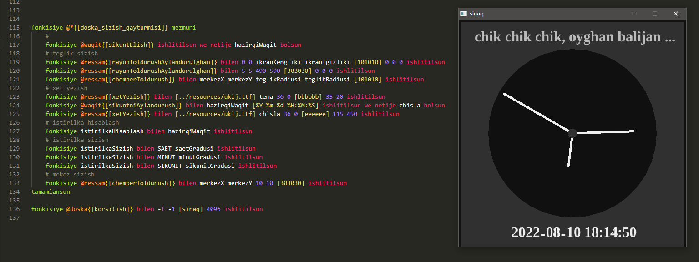

# UyghurScript

## 0. description

> a toy script interpreter written in c, u can write & run your script written in uyghur language grammar with it ...

> there is a [vscode extension](https://marketplace.visualstudio.com/publishers/kompasim) for highlighting and autocompleting.



## 1. usage

* run command `./release/uyghur.exe ./examples/hello.ug` to execute hello world

* run command `./release/uyghur.exe ./examples/yuguresh.ug` to execute [raylib](https://github.com/raysan5/raylib) binding

* double cick `./release/saet.exe` to run clock program



* double cick `./release/hisabliguch.exe` to run calculator program

 


## 2. variable declaration

```powershell
# declare
miqdar m qimmiti quruq bolsun

# free
m qimmiti quruq bolsun
```

## 3. type conversion

```powershell
miqdar m qimmiti [yezish] bolsun

# get func by string
m qimmiti fonkisiye bolsun
ikrangha m yezilsun

# convert value to boolean
m qimmiti logika bolsun
ikrangha m yezilsun

```

## 4. calculator

```powershell
# arthimetic
x = 1 + 2 # 3
x = 1 + 2 * 3 # 9
x = 1 + (2 * 3) # 7
x = 64 ^ (1 / 3) # 4

# bitwise
x = 3 & 2 # 2
x = 3 | 2 # 3
x = 3 ~ 2 # 1

# boolean
x = rast & yalghan # yalghan
x = rast | yalghan # rast
x = rast ~ yalghan # rast

# logic
x = [2] ? 2 # false
x = 2 < 3 # true
x = [ab] > [ac] # false 

# string
x = [ab] + [cd] # abcd
x = [ab] * 2 # abab
```

## 5. operations

```powershell
# read a value
ikrandin sQimmet oqulsun
# print a value
ikrangha sQimmet yezilsun
```

## 6. io

```powershell
# output
ikrangha [Ana Tilim Zer Tilim!] yezilsun

# input
ikrandin a oqulsun
a qimmiti [mezmun:] ulanghan a bolsun
ikrangha a yezilsun
```

## 7. if

```powershell
eger 0 bolsa
    ikrangha [if] yezilsun
egerde rast bosa
    ikrangha [elif] yezilsun
bolmisa
    ikrangha [else] yezilsun
tamamlansun
```

## 8. while

```powershell
nawada rast bolsa
    ikrangha [while] yezilsun
tamamlansun
```

## 9. exception

```powershell
xataliq e mezmuni
    x = 3 / 0
tamamlansun
# return e == empty if no exception
eger e bolsa
    ikrangha [exception:] yezilsun
    ikrangha e yezilsun
bolmisa
    ikrangha [successful!] yezilsun
tamamlansun
# exception: cannot devided by zero
```

## 10. functions

```powershell
# a global variable
miqdar yighinda qimmiti 0 bolsun

# a function with two arguments
fonkisiye sanQushush miqdar x y mezmuni
    yighinda = x + y
    netije yighinda qayturulsun
tamamlansun

# a string varibale of function name
funcName qimmiti [sanYezish] bolsun

# get function by string value
funcName qimmiti fonkisiye bolsun

# call functions and receive result
fonkisiye funcName bilen 10 20 ishlitilsun we netije result bolsun

# print the result value received
ikrangha result yezilsun
```

## 11. box

```powershell
#  declare a box
s qimmiti sanduq bolsun

# put a number
@s[yighinda] qimmiti 123 bolsun

# set a method
fonkisiye @s[sinaqFonkisiye] miqdar x y mezmuni
  @-[yighinda] = x + y
tamamlansun

# this box pointer: -, find in binding box
@-[keyName]

# this module pointer: +, find in current module
@+[keyName]

# global box pointer: *, find in global scope
@*[keyName]

# supported key types: variable, string, number
@boxName{variableName}
@boxName[stringKey]
@boxName(123)
```

## 12. bridge

> u can get the bridge objet and communicate between c and script, just check `main.c` for more information

*  register a box to script
```c
Bridge_startBox(bridge);
Bridge_bindValue(bridge, "num", "text...");
Bridge_bindValue(bridge, "str", "text...");
Bridge_register(bridge, "boxName"); // NULL for global scope
```

* call script function from c, and get the result
```c
Bridge_startFunc(bridge);
Bridge_pushValue(bridge, "argument");
Bridge_call(bridge, "functionName");
char resultType = Bridge_topType(bridge);
void *resultValue = Bridge_receiveValue(bridge);
```

* call c function from script, and return result
```c
void testFunc(Bridge *bridge)
{
    int a = Bridge_receiveNumber(bridge);
    int b = Bridge_receiveNumber(bridge);
    int c = a + b;
    Bridge_returnNumber(bridge, c);
}
Bridge_startBox(bridge);
Bridge_bindNative(bridge, "sinaqFonkisiye", testFunc);
Bridge_register(bridge, NULL);
```

## 13. import

```powershell
# bolek_programma.ug
ikrangha [bolek programmidin salam ...] yezilsun
bolektikiQimmet qimmiti [bolektiki sinaq qimmet ...] bolsun

# bash_programma.ug
ikrangha [bash programmidin salam ...] yezilsun
fonkisiye ekirish bilen [../bolek_programma.ug] ishlitilsun we netije bolekSanduq bolsun
ikrangha @bolekSanduq[bolektikiQimmet] yezilsun

# run the program
`.uyghur.exe ./bash_programma.ug`

# get the result
bash programmidin salam ...
bolek programmidin salam ...
bolektiki sinaq qimmet ...
```

## -2. todo

* objective
* libraries
* ...

## -1. others

> i am still working on it ...
