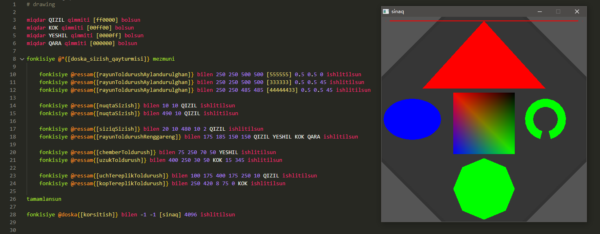

# UyghurScript

## 0. description

> a toy script interpreter written in c, u can write & run your script written in uyghur language grammar with it ...

> there is a [vscode extension](https://github.com/kompasim/uyghurscript-vscode-extension) for highlighting and autocompleting.

## 1. usage

* just double cick `./release/uyghur.exe` to execute integrated script

* run the command `./release/uyghur.exe ./examples/hello.ug` to execute hello world

* double cick `./release/calculator.exe` to run calculator program

 

* run `./release/uyghur.exe ./examples/ressam.ug` to run the [raylib](https://github.com/raysan5/raylib) binding example




## 2. data types and variable declaration

```python
# declare
miqdar m qimmiti quruq bolsun

# free
m qimmiti quruq bolsun

# string
s qimmiti [Salam Uyghur Script!] bolsun

# number
n qimmiti 1 bolsun

# bool (rast, yalghan)
b qimmiti rast bolsun

# empty
d qimmiti quruq bolsun
```

## 3. expressions

```python
# assign a value
b qimmiti yalghan bolsun

# string expressions (teng, ulanghan)
s qimmiti [hi! ] ulanghan [boy ...] bolsun

# number expressions (teng, qushulghan, elinghan, kupeytilgen, bulungen)
n qimmiti n kupeytilgen 10 bolsun

# logic expressions (teng, kichik, chong)
b qimmiti a kichik 5 bolsun

# logic expressions (teng, hemde, yaki)
b qimmiti b hemde yalghan bolsun

# calculator (no operator precedence)

x = 1 + 2
# 3

x = 1 + 2 * 3
# 9

x = 1 + (2 * 3)
# 7

x = 64 ^ (1 / 3)
# 4

```

## 4. operations

```python
sQimmet qimmiti [yalghan] bolsun

# transforming type (san, xet, quruq, logika, ekische, fonkisiye)
sQimmet qimmiti logika bolsun

# logic not
sQimmet qimmiti ekische bolsun

# print a logic value
ikrangha sQimmet yezilsun
```

## 5. io

```python
# output
ikrangha [Ana Tilim Zer Tilim!] yezilsun

# input
ikrandin a oqulsun
a qimmiti [mezmun:] ulanghan a bolsun
ikrangha a yezilsun
```

## 6. if

```python

a qimmiti quruq bolsun
b qimmiti rast bolsun
c qimmiti rast bolsun
d qimmiti [quruq!!!] bolsun

# the left side can be any value
eger a qimmiti rast bolsa
    ikrangha [eger] yezilsun
    d qimmiti [eger] bolsun
egerde b qimmiti rast bolsa
    ikrangha [egerde1] yezilsun
    d qimmiti [egerde1] bolsun
egerde c qimmiti rast bolmisa
    ikrangha [egerde2] yezilsun
    d qimmiti [egerde2] bolsun
bolmisa
    d qimmiti [ichide] bolsun
    ikrangha d yezilsun
    d qimmiti [bolmisa] bolsun
    ikrangha d yezilsun
tamamlansun

ikrangha d yezilsun
```

## 7. while

```python
yezildighanQimmet qimmiti [] bolsun
sinaqQimmet qimmiti 1 bolsun
tekshurulmeQimmet qimmiti rast bolsun

# the left side can be any value
nawada tekshurulmeQimmet qimmiti rast bolsa
    sinaqQimmetS qimmiti sinaqQimmet bolsun
    sinaqQimmetS qimmiti xet bolsun
    yezildighanQimmet qimmiti [nawada: sanaq ] ulanghan sinaqQimmetS bolsun
    ikrangha yezildighanQimmet yezilsun
    sinaqQimmet qimmiti sinaqQimmet qushulghan 1 bolsun
    tekshurulmeQimmet qimmiti sinaqQimmet kichik 5 bolsun
tamamlansun
```

## 8. functions

```python
# a variable for function result
yighinda qimmiti 0 bolsun

# function without args and return
fonkisiye sanYezish mezmuni
    ikrangha yighinda yezilsun
tamamlansun

# a function receiving two arguments and returning a result
fonkisiye sanQushush miqdar x y mezmuni
    waqitliqMiqdar qimmiti 0 bolsun
    waqitliqMiqdar qimmiti x qushulghan y bolsun
    netije waqitliqMiqdar qayturulsun
tamamlansun

# call function with two arguments and receive the result
fonkisiye sanQushush bilen 10 20 ishlitilsun we netije yighinda bolsun

# a string varibale storing a function name
funcName qimmiti [sanYezish] bolsun

# transform the string to a func which is the string value targeting
funcName qimmiti fonkisiye bolsun

# call a function without any argument and result 
fonkisiye funcName ishlitilsun
```

## 9. box

```python
#  declare a box
s qimmiti sanduq bolsun

# put a number
@s{[yighinda]} qimmiti 1 qushulghan 2 bolsun

# bind a function
fonkisiye @s{[sinaqFonkisiye]} miqdar x y mezmuni
    @s{[yighinda]} qimmiti x qushulghan y bolsun
    ikrangha @s{[yighinda]} yezilsun
    netije @s{[yighinda]} qayturulsun
tamamlansun

# call and get result as a box varibale
fonkisiye @s{[sinaqFonkisiye]} bilen 11 22 ishlitilsun we netije @s{[sinaqNetije]} bolsun

# print the resultType
ikrangha @s{[sinaqNetije]} yezilsun

# this box pointer: -, find in closest box
@-{[keyName]}

# this module pointer: +, find in closest module
@+{[keyName]}

# global box pointer: *, find in global scope
@*{[keyName]}

# supported key types: variable, string, number
@boxName{variableName}
@boxName{123}
@boxName{[stringKey]}
@boxName[stringKey]
```

## 10. bridge

> u can get the bridge objet and communicate between c and script, just check `main.c` for more information

```c
// register c values to script (NULL in start function to global scope)
Bridge_startBox(bridge, NULL);
Bridge_pushKey(bridge, "keyName");
Bridge_pushValue(bridge, NULL);
Bridge_register(bridge);
```

```c
// call script function from c, and get the result
Bridge_startFunc(bridge, "functionName");
Bridge_pushValue(bridge, NULL);
Bridge_call(bridge);
char *resultType = Bridge_topType(bridge);
void *resultValue = Bridge_nextValue(bridge);
```

## 11. import

```python
# bolek_programma.ug
ikrangha [bolek programmidin salam ...] yezilsun
bolektikiQimmet qimmiti [bolektiki sinaq qimmet ...] bolsun

# bash_programma.ug
ikrangha [bash programmidin salam ...] yezilsun
fonkisiye ekirish bilen [../bolek_programma.ug] ishlitilsun we netije bolekSanduq bolsun
ikrangha @bolekSanduq{[bolektikiQimmet]} yezilsun

# run the program
`.uyghur.exe ./bash_programma.ug`

# get the result
bash programmidin salam ...
bolek programmidin salam ...
bolektiki sinaq qimmet ...
```

## -2. todo

* traceback
* libraries
* editor support (highlight and autocomplete)
* ...

## -1. others

> i am still working on it ...
