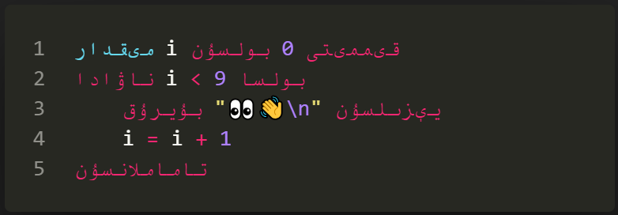
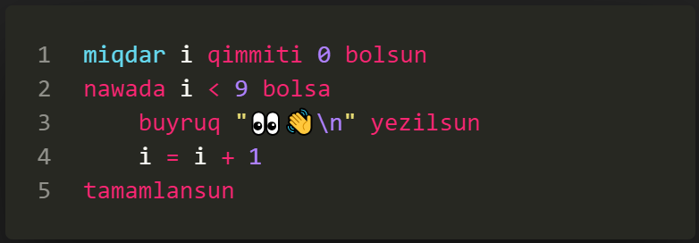
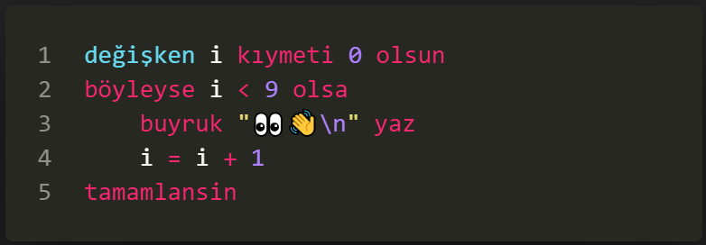
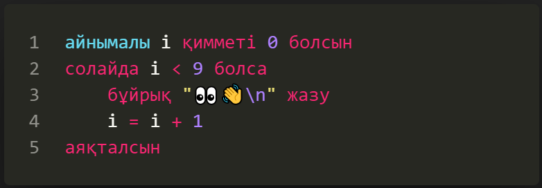

# UyghurScript

## 0. description

> a toy script interpreter written in c, u can write & run your script written in uyghur language grammar with it ...

> 

* run command `./release/uyghur.exe` to get help content

* double cick `./release/yuguresh.exe` to run raylib example


## 1. multiple langauge


* a. [english](examples/language/en)


* b. [ئۇيغۇرچە](examples/language/uy)




* c. [uyghurche](examples/language/ug)




* d. [o'zbekcha](examples/language/uz)


* e. [Türkçe](examples/language/tr)




* f. [қазақша](examples/language/kz)




## 2. highlight & translating

* vscode [extension](https://marketplace.visualstudio.com/publishers/Atypicalim) for highlighting and autocompleting.

* language [converter](https://Atypicalim.github.io/others/converter.html) for translating different languages.

## 3. supported features

* [variable](examples/features/variable)

```powershell
# a dynamic var
variable m value empty made

# a static var
variable n value num made

# set val
m = "salam dunya!"

# free val
m value empty made

# type error
n = "sinaq..."
```

* [type](examples/features/type)

```powershell
variable m value "yezish" made

# get func by string
m value worker made
command m write

# convert value to boolean
m value logic made
command m write
```

* [calculation](examples/features/calculation)

```powershell
# arthimetic
x = 1 + 2 # 3
x = 1 + 2 * 3 # 9
x = 1 + (2 * 3) # 7
x = 64 ^ (1 / 3) # 4

# bitwise
x = 3 & 2 # 2
x = 3 | 2 # 3
x = 3 ~ 2 # 1

# boolean
x = right & wrong # wrong
x = right | wrong # right
x = right ~ wrong # right

# logic
x = "2" ? 2 # false
x = 2 < 3 # true
x = "ab" > "ac" # false 

# string
x = "ab" + "cd" # abcd
x = "ab" * 2 # abab

# checking
x = 10 % 7 # 3
x = 10 % num # true
x = 10 % empty # false
```

* [command](examples/features/command)

```powershell
# read a value
command a read

# print a value
command a write
```

* [if](examples/features/if)

```powershell
if 0 then
    command "if" write
elif right then
    command "elif" write
else
    command "else" write
finish
```

* [while](examples/features/while)

```powershell
variable i value 0 made
while i < 9 then
    command "while\n" write
    i = i + 1
finish
```

* [spread](examples/features/spread)

```powershell
speaded "abc..." variable i v become
    command i write
    command "\t" write
    command v write
    command "\n" write
finish
```

* [worker](examples/features/worker)

```powershell
# a local variable
variable t value 0 made

# a function with two arguments
worker f variable x y content
    t = x + y
    result t returned
finish

# call functions and receive result
worker f with 10 20 applied and r received

# print the result value received
command r write
```

* [exception](examples/features/exception)

```powershell
variable x value empty made

# try block
exception e become
    x = 3 / 0
finish

# catch block
if e then
    command "exception:\n" write
    command e write
    command "\n" write
else
    command "successful!\n" write
finish
```

* [container](examples/features/container)

```powershell
#  declare a list
t value list made
#  declare a dict
s value dict made

# generate a list
t = [11, 22, "abc"]
# generate a dict
s = {a: "aa", b: "bb", c: 123}

# put a num key
@t:1 = 456
# put a str key
@s:k = "abc"
# put a var key
@s{v} = val

# alias: this: - bu, module: + bolek, global: * global

# check type
b = t % list
```

* [objective](examples/features/objective)

```powershell
# an assister with one argument
assister X variable x content
    @-:x = x
finish

# assister func
worker @X:test content
    command "X.test...\n" write
finish

# a creator with one arguments
creator Y variable y content
    creator X with "arg xxx ...\n" applied 
    @-:y = y
finish

# creator func
worker @Y:test content
    worker @X:test applied
    command "Y.test...\n" write
finish

# call creator using an assister and receive object
creator Y with "arg yyy ...\n" applied and r received

# print the object value received
command @r:x write # arg xxx ...
command @r:y write # arg yyy ...

# call creator func which calling assister func inside
worker @r:test applied
# X.test...
# Y.test...

# check obj is created by or assisted by
if r % X then
    command "yes\n" write
finish
# yes
```

* [import](examples/features/import)

```powershell
# other.xx
variable x value "other..." made

# main.xx
worker ekirish with "../other.xx" applied and m received
command @m:x write

# run the program
`.uyghur.exe ./main.xx`

# get the result
other...
```


--------------------------------

## 4. bridge interfaces

> u can get the bridge objet and communicate between c and script, just check `bridge.c` for more information

*  register a box to script
```c++
Bridge_startBox(bridge);
Bridge_bindValue(bridge, "num", "text...");
Bridge_bindValue(bridge, "str", "text...");
Bridge_register(bridge, "boxName"); // NULL for global scope
```

* call script function from c, and get the result
```c++
Bridge_startFunc(bridge);
Bridge_pushValue(bridge, "argument");
Bridge_call(bridge, "functionName");
char resultType = Bridge_topType(bridge);
void *resultValue = Bridge_receiveValue(bridge);
```

* call c function from script, and return result
```c++
void testFunc(Bridge *bridge)
{
    int a = Bridge_receiveNumber(bridge);
    int b = Bridge_receiveNumber(bridge);
    int c = a + b;
    Bridge_returnNumber(bridge, c);
}
Bridge_startBox(bridge);
Bridge_bindNative(bridge, "sinaqFonkisiye", testFunc);
Bridge_register(bridge, NULL);
```

## 5. todo

* objective
* libraries
* ...

## 6. others

> i am still working on it ...
