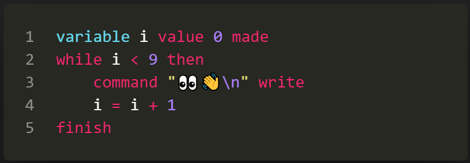

# UyghurScript

## 0. description

> a toy script interpreter written in c, u can write & run your script written in uyghur language grammar with it ...

> 

* run command `./release/uyghur.exe` to get help content

* double cick `./release/yuguresh.exe` to run raylib example


## 1. multiple langauge


* a. english




* b. ئۇيغۇرچە


* c. uyghurche


* d. o'zbekcha


* e. Türkçe


* f. қазақша


## 2. highlight & translating

* vscode [extension](https://marketplace.visualstudio.com/publishers/kompasim) for highlighting and autocompleting.

* language [converter](https://kompasim.github.io/others/converter.html) for translating different languages.

## 3. supported features

* variable

```powershell
# declare variable
miqdar m qimmiti quruq bolsun

# set value
m = [hello world!]

# free variable
m qimmiti quruq bolsun
```

* type

```powershell
miqdar m qimmiti [yezish] bolsun

# get func by string
m qimmiti fonkisiye bolsun
buyruq m yezilsun

# convert value to boolean
m qimmiti logika bolsun
buyruq m yezilsun
```

* command

```powershell
# read a value
buyruq a oqulsun

# print a value
buyruq a yezilsun
```

* if

```powershell
eger 0 bolsa
    buyruq [if] yezilsun
egerde rast bosa
    buyruq [elif] yezilsun
bolmisa
    buyruq [else] yezilsun
tamamlansun
```

* while

```powershell
miqdar i qimmiti 0 bolsun
nawada i < 9 bolsa
    buyruq [while\n] yezilsun
    i = i + 1
tamamlansun
```

* spread

```powershell
yeyilghan [abc...] miqdar i v bulup
    buyruq i yezilsun
    buyruq [\t] yezilsun
    buyruq v yezilsun
    buyruq [\n] yezilsun
tamamlansun
```

* function

```powershell
# a local variable
miqdar t qimmiti 0 bolsun

# a function with two arguments
fonkisiye f miqdar x y mezmuni
    t = x + y
    netije t qayturulsun
tamamlansun

# call functions and receive result
fonkisiye f bilen 10 20 ishlitilsun we netije r bolsun

# print the result value received
buyruq r yezilsun
```

* exception

```powershell
# try block
xataliq e mezmuni
    x = 3 / 0
tamamlansun

# catrch block
eger e bolsa
    buyruq [exception:] yezilsun
    buyruq e yezilsun
bolmisa
    buyruq [successful!] yezilsun
tamamlansun
```

* calculate

```powershell
# arthimetic
x = 1 + 2 # 3
x = 1 + 2 * 3 # 9
x = 1 + (2 * 3) # 7
x = 64 ^ (1 / 3) # 4

# bitwise
x = 3 & 2 # 2
x = 3 | 2 # 3
x = 3 ~ 2 # 1

# boolean
x = rast & yalghan # yalghan
x = rast | yalghan # rast
x = rast ~ yalghan # rast

# logic
x = [2] ? 2 # false
x = 2 < 3 # true
x = [ab] > [ac] # false 

# string
x = [ab] + [cd] # abcd
x = [ab] * 2 # abab
```

* box

```powershell
#  declare a box
s qimmiti sanduq bolsun

# put a number
@s[v] qimmiti 0 bolsun

# set a method
fonkisiye @s[f] miqdar x y mezmuni
  @-[yighinda] = @-[v] * 2
tamamlansun

# supported aliases 
# box: @-[keyName]
# module: @+[keyName]
# global: @*[keyName]

# supported keys
# variable: @boxName{variableName}
# string: @boxName[stringKey]
# number: @boxName(123)
```

* import

```powershell
# other.xx
miqdar x qimmiti [other...] bolsun

# main.xx
fonkisiye ekirish bilen [../other.xx] ishlitilsun we netije m bolsun
buyruq @m[x] yezilsun

# run the program
`.uyghur.exe ./main.xx`

# get the result
other...
```


--------------------------------

## 4. bridge interfaces

> u can get the bridge objet and communicate between c and script, just check `bridge.c` for more information

*  register a box to script
```c++
Bridge_startBox(bridge);
Bridge_bindValue(bridge, "num", "text...");
Bridge_bindValue(bridge, "str", "text...");
Bridge_register(bridge, "boxName"); // NULL for global scope
```

* call script function from c, and get the result
```c++
Bridge_startFunc(bridge);
Bridge_pushValue(bridge, "argument");
Bridge_call(bridge, "functionName");
char resultType = Bridge_topType(bridge);
void *resultValue = Bridge_receiveValue(bridge);
```

* call c function from script, and return result
```c++
void testFunc(Bridge *bridge)
{
    int a = Bridge_receiveNumber(bridge);
    int b = Bridge_receiveNumber(bridge);
    int c = a + b;
    Bridge_returnNumber(bridge, c);
}
Bridge_startBox(bridge);
Bridge_bindNative(bridge, "sinaqFonkisiye", testFunc);
Bridge_register(bridge, NULL);
```

## 5. todo

* objective
* libraries
* ...

## 6. others

> i am still working on it ...
